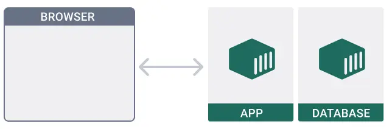
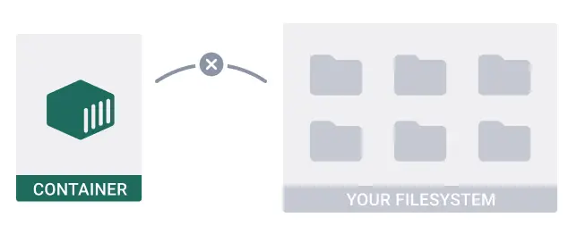
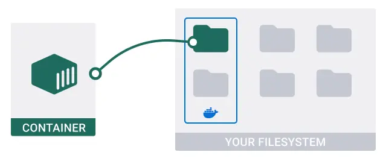

## Intro To Docker
# git clone https://github.com/docker/welcome-to-docker
# Check that the 'Dockerfile' do exist

## Tip

To run Docker commands, you must use a terminal. Based on your operating system, you can open a terminal by doing the following:

For Windows, select the Start Menu, specify cmd, and then select Command Prompt.

For Mac, and Linux use the Terminal 

# cd /path/to/welcome-to-docker/

# To build the container 'docker build -t welcome-to-docker .'

# docker run -d -p 8088:80 --name welcome-to-docker docker/welcome-to-docker   #To run the container


```
This docker run command is used to create and start a Docker container based on an image named docker/welcome-to-docker. <br>
Let's  break down the command and its options: <br>

docker run: This command is used to run a Docker container from an image.    <br>
-d: This option runs the container in detached mode, meaning it runs in the background and you get control of your terminal back. <br>
-p 8088:80: This option maps port 8088 on the host machine to port 80 inside the container.   <br>
It means that you can access the  container's service running on port 80 from your host machine's port 8088.  <br>
--name welcome-to-docker: This option assigns a name to the container, in this case, welcome-to-docker.   <br>
docker/welcome-to-docker: This is the name of the Docker image from which to create the container.  <br>
 In this case, it's pulling an image named docker/welcome-to-docker from the Docker Hub repository.  <br>
So, when you run this command, Docker will start a new container named welcome-to-docker based on the docker/welcome-to-docker image. <br>
 This container will run a service accessible on port 8088 of your host machine, which forwards requests to port 80 inside the container. <br>
  The container runs in the background (detached mode), allowing you to continue using your terminal for other tasks. <br>
```
# On your local machine visit  http://localhost:8088  if it is on a virtual machine make sure you have open port 8088 
# and visit  http://IP-Address:8088 <br>

#  ===============================================================================================

# Run multi-container applications

A typical application will have a frontend, backend(app) and a database  <br>
If you've already completed the How do I run a container using 'welcome-to-docker' walkthrough, you learned that you must start each container individually. <br>
 Imagine how great it would be if a tool could start multiple containers with a single command. That tool is Docker Compose.<br>
 # Step 1: Get the sample application
 `git clone https://github.com/docker/multi-container-app`  <br>

 The sample application is a simple todo application built using ExpressJS and Node.js. The application saves all todos in a MongoDB database. You don't need to know any of these technologies to continue with the walkthrough. <br>

 Web Browser <==========> backend(NodeJS) + database(MongoDB)

 

# Step 2: Dig into the Compose file
view the Compose.yaml file using your code editor in our case pls open it with VSCode

# Step 3 Run the application
cd /path/to/multi-container-app/
    docker compose up -d
    In the previous command, the -d flag tells Docker Compose to run in detached mode. <br>
  
# step 4, Open app/views/todos.ejs in a text or code editor, then change the text on line 18
Save the changes in app/views/todos.ejs. <br>
View your application at http://localhost:3000 to see the changes in real-time. <br>
# Step 5: Develop in your containers
cd /path/to/multi-container-app/
docker compose watch
Save the changes in app/views/todos.ejs.
View your application at http://localhost:3000 to see the changes in real-time.

# Step 6: Delete everything and start over

# Persist container data
Docker isolates all content, code, and data in a container from your local filesystem. When you delete a container, Docker deletes all the content within that container.


`git clone https://github.com/docker/multi-container-app` to clone the app

Sometimes, you may want to persist the data that a container generates. To do this, you can use volumes. <br>



To persist data after you delete a container, use a volume. A volume is a location in your local filesystem, automatically managed by Docker Desktop. <br>

To add a volume to this project, open the compose.yaml file in a code or text editor, and then uncomment the following lines.<br>
```
todo-database:
    # ...
    volumes:
      - database:/data/db

# ...
volumes:
  database:
```

The volumes element that is nested under todo-database tells Compose to mount the volume named database to /data/db in the container for the todo-database service.

The top-level volumes element defines and configures a volume named database that can be used by any of the services in the Compose file.

 # Run the application 
 `cd /path/to/multi-container-app/`
 `docker compose up -d`

To be continue `https://docs.docker.com/guides/walkthroughs/access-local-folder/`
# Third Project.
# Deploying a Java application using docker.

